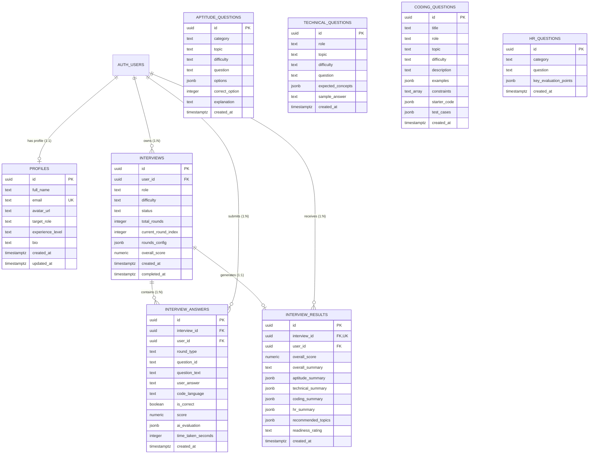

# AI Interview Preparation System — Comprehensive Technical Documentation & Architecture Report

> **Document Type**: System Architecture, Codebase Specification & Technical Audit  
> **Status**: Current Production State  
> **Target Audience**: AI Engineering Assistants, Technical Architects, Full-Stack Developers  
> **Author**: Antigravity Technical Documentation Agent  
> **Generated Date**: October 6, 2026  

---

## 1. PROJECT OVERVIEW

- **Project Name**: AI Interview Preparation System (`ai-interview-preparation-system` / `Prep-Interview`)
- **Primary Purpose**: An end-to-end, full-stack AI-driven mock interview and career preparation platform designed to simulate realistic corporate screening and technical hiring loops for 37 technology job roles.
- **Application Capabilities**:
  - Multi-round structured interview simulation: **Aptitude & Logic**, **Technical Architecture**, **Coding / DSA (C++ Only)**, and **HR / Behavioral Communication**.
  - Dual-mode AI evaluation: Real-time Google Gemini LLM evaluation backed by deterministic, zero-downtime heuristic evaluation engines.
  - Role-tailored question pools and curricula across 37 engineering, data, cloud, security, and quality roles.
  - Comprehensive question navigation with real-time state tracking in Question Palettes across all 4 rounds.
  - Data-based scoring scorecards for Aptitude and final cumulative multi-round performance appraisal reports with instant PDF export.
  - Full voice synthesis (Text-to-Speech) and voice transcription (Web Speech Recognition API) for hands-free answering.
  - Dark mode and Light mode responsive enterprise UI design system.

### Current Interview Flow
```text
User Authentication (Login / Signup / Mock Fallback)
         ↓
Dashboard (Recent attempts, statistics, progress tracking)
         ↓
Interview Setup Wizard (interview.html)
  ├── Step 1: Target Job Role Selection (37 roles across 6 categories with live search)
  ├── Step 2: Difficulty Level (Beginner / Intermediate / Advanced)
  └── Step 3: Interview Rounds Selection (Aptitude, Technical, Coding, HR)
         ↓
Interview Session Creation (POST /api/interviews → Supabase DB / Memory Store)
         ↓
Round 1: Aptitude & Logic (aptitude.html) — 30 MCQs, timed (30 mins), immediate factual scorecard
         ↓
Round 2: Technical Architecture (technical.html) — 30 structured conceptual questions, voice/text input, AI evaluation vs. expected concepts
         ↓
Round 3: Coding / DSA (coding.html) — 30 algorithmic problems in C++, starter template, candidate approach explanation, 3-state evaluation
         ↓
Round 4: HR / Behavioral (hr.html) — 30 behavioral/situational questions, STAR framework analysis, voice transcription
         ↓
Finalization (POST /api/interviews/:id/finalize)
         ↓
Cumulative Performance Appraisal & PDF Report (report.html)
```

### How Rounds Connect
- When an interview session is created via `POST /api/interviews`, the backend persists an interview record with `rounds_config: ['aptitude', 'technical', 'coding', 'hr']` and `current_round_index: 0`.
- Each round reads the interview configuration from `sessionStorage` / URL query parameters (`id`, `role`, `difficulty`).
- At the end of each round:
  1. The client records answers via the respective round API endpoint (`/api/aptitude/answers`, `/api/technical/evaluate`, `/api/coding/submit`, `/api/hr/evaluate`).
  2. The client calls `PATCH /api/interviews/:id/progress` to advance `current_round_index`.
  3. The client transitions to the next configured round page (`window.location.href = '${nextRound}.html?...'`).
  4. After the final round, the client triggers `POST /api/interviews/:id/finalize`, which calculates weighted averages, round summaries, weak/strong topics, improvement deltas from prior attempts, and redirects to `report.html?id=:id`.

---

## 2. TECHNOLOGY STACK

### Frontend
- **Framework / Core**: Vanilla ES6+ JavaScript, Modular Architecture (No heavy build frameworks or node bundlers on frontend).
- **HTML / Templates**: Semantic HTML5 multi-page application (11 distinct HTML pages).
- **Styling / CSS**: Modern CSS3 Design System with CSS Custom Properties (Variables), Flexbox, CSS Grid, Responsive Breakpoints, Dark/Light Theme Support (`data-theme="dark"` / `data-theme="light"`). No external CSS utility frameworks (pure custom CSS).
- **Component Libraries / External CDNs**:
  - `@supabase/supabase-js@2` (CDN loaded via `<script src="https://cdn.jsdelivr.net/npm/@supabase/supabase-js@2"></script>`)
  - `html2pdf.js@0.10.1` (Client-side HTML-to-PDF conversion)
- **State Management**: Distributed Page Controllers, Local State Variables, HTML5 `localStorage` (Auth tokens, user info, theme preferences), URL Query Parameters.
- **Routing**: Multi-Page Application (MPA) with SPA-like fallbacks handled by backend Express static serving.

### Backend
- **Runtime & Language**: Node.js (v18+) with native ES Modules (`"type": "module"`).
- **Web Framework**: Express.js (`express@^4.21.2`).
- **Middleware**:
  - `cors@^2.8.5` (Configured with dynamic origin validation)
  - `helmet@^8.0.0` (Security headers, Cross-Origin Resource Policy)
  - `morgan@^1.10.0` (HTTP request logging in `dev` and `combined` formats)
  - `dotenv@^16.4.7` (Environment variable loading)
- **API Architecture**: RESTful JSON API organized under `/api/*` prefix.
- **Session & Auth Handling**: Supabase JWT verification (`supabaseAdmin.auth.getUser(token)`) with automatic fallbacks to mock authentication tokens (`mock_*`, `demo_*`) for offline and testing environments.
- **Error Handling**: Centralized Express error handler middleware (`errorHandler.js`).

### Database
- **Database Engine**: PostgreSQL 15+ hosted on Supabase Cloud.
- **Client Libraries**: `@supabase/supabase-js@^2.49.1` and `pg@^8.23.1`.
- **Primary Access Layer**: `supabaseAdmin` client initialized with Supabase Service Role Key (bypasses RLS for backend operations) or Anon Key.
- **Row Level Security (RLS)**: Enabled across all user-sensitive tables (`profiles`, `interviews`, `interview_answers`, `interview_results`).
- **In-Memory Fallback Engine**: `mockStore` in `backend/utils/memoryStore.js` containing in-memory Maps (`interviews`, `answers`, `results`, `profiles`) and pre-seeded question banks (30 Aptitude, 30 Technical, 32 Coding, 30 HR).

### AI Providers & Models
1. **Google Gemini (Primary)**:
   - **Provider**: Google Generative AI (`@google/genai@^2.27.0` & direct REST API).
   - **Model**: `gemini-1.5-flash` / `gemini-2.5-flash` (via `GEMINI_API_URL`).
   - **Usage**: Dynamic question generation, Technical structured answer evaluation, Coding algorithmic verification, HR STAR evaluation, Final appraisal synthesis.
   - **Location**: Backend (`backend/services/aiService.js`).
2. **Groq (Secondary / Alternative)**:
   - **Provider**: Groq Cloud SDK (`groq-sdk@^0.15.0`).
   - **Model**: `llama-3.3-70b-versatile`.
   - **Location**: Backend (`backend/services/aiService.js`).
3. **Deterministic Heuristic AI Engine (Fallback & Ground Truth)**:
   - **Provider**: Proprietary rule-based AST and keyword/semantic evaluator built directly in Node.js.
   - **Usage**: Evaluates code syntax, runtime safety, infinite loops, and problem invariants when external LLM APIs are offline or unconfigured.

### Deployment
- **Source Control**: GitHub repository: `https://github.com/khrishsonawane-a11y/Prep-Interview.git` (`main` branch).
- **Hosting Platform**: Render (Web Service).
- **Build Command**: `npm install && npm run postinstall` (installs root and `backend/node_modules`).
- **Start Command**: `npm start` (`node backend/server.js`).
- **Static Hosting**: Express statically serves `frontend/` directory directly on the root port.

---

## 3. COMPLETE PROJECT FILE/FOLDER STRUCTURE

```text
AI-Interview-Preparation-System/
├── .gitignore                          # Git ignore rules (node_modules, .env, executables)
├── package.json                        # Root NPM package manifest (scripts & dependencies)
├── README.md                           # Project documentation & local setup instructions
├── database/
│   ├── schema.sql                      # Complete PostgreSQL schema (tables, RLS policies, triggers)
│   └── seed_data.sql                   # SQL seed scripts for question banks
├── backend/
│   ├── .env                            # Local backend environment variables (DO NOT COMMIT)
│   ├── .env.example                    # Template for required environment variables
│   ├── package.json                    # Backend NPM package manifest
│   ├── package-lock.json               # Backend locked dependency tree
│   ├── server.js                       # Express application bootstrap & static server
│   ├── config/
│   │   └── supabase.js                 # Supabase client initializer & config validator
│   ├── controllers/
│   │   ├── aiController.js             # General AI helper endpoints (generate, evaluate, feedback)
│   │   ├── aptitudeController.js       # Aptitude question retrieval & answer submission
│   │   ├── codingController.js         # Coding question retrieval & submission evaluation
│   │   ├── hrController.js             # HR question retrieval & behavioral evaluation
│   │   ├── interviewController.js      # Interview session creation, history, progress, finalization
│   │   ├── profileController.js        # User profile retrieval & stats aggregation
│   │   └── technicalController.js     # Technical question retrieval & structured evaluation
│   ├── middleware/
│   │   ├── auth.js                     # JWT / Bearer token extraction & user authentication
│   │   └── errorHandler.js             # Centralized JSON error response handler
│   ├── routes/
│   │   ├── aiRoutes.js                 # Express router for /api/ai
│   │   ├── aptitudeRoutes.js           # Express router for /api/aptitude
│   │   ├── codingRoutes.js             # Express router for /api/coding
│   │   ├── healthRoutes.js             # Health check & system diagnostics (/api/health)
│   │   ├── hrRoutes.js                 # Express router for /api/hr
│   │   ├── interviewRoutes.js          # Express router for /api/interviews
│   │   ├── profileRoutes.js            # Express router for /api/profile
│   │   └── technicalRoutes.js          # Express router for /api/technical
│   ├── services/
│   │   ├── aiService.js                # Core LLM prompt engineering, evaluation, and heuristic engines
│   │   └── codeExecutionService.js     # Static syntax validation, runtime checking, algorithm rules
│   ├── utils/
│   │   └── memoryStore.js              # In-memory storage maps & 122+ seeded mock questions
│   ├── scripts/
│   │   ├── enrich_memory_store.js      # Utility script for question dataset enrichment
│   │   ├── generate_seed_data.js       # Generator for database seed data
│   │   ├── migrate.js                  # Database migration helper
│   │   └── populate_python_codes.js    # Multi-language code snippet generator
│   └── [Test Suites]
│       ├── test_all_rounds_pools.js    # Validates question bank sizes across all rounds
│       ├── test_api.js                 # General API integration test suite
│       ├── test_aptitude_result.js     # Validates Aptitude data-based score calculations
│       ├── test_aptitude_voice.js      # Tests Aptitude speech and TTS bindings
│       ├── test_c_cpp_validation.js    # C/C++ syntax checking tests
│       ├── test_coding_execution.js    # Code execution pipeline unit tests
│       ├── test_cpp_simplified_coding.js # C++ simplified coding tests
│       ├── test_final_cumulative.js    # Final report score aggregation tests
│       ├── test_hidden_solution.js     # Verifies reference solution hidden in candidate editor
│       ├── test_independent_coding_system.js # Validates coding state isolation & 3-state verdicts
│       ├── test_job_roles_search.js    # Validates 37 job roles and search filter logic
│       ├── test_modern_improvements.js # UI regression verification suite
│       ├── test_multilang_coding.js    # Legacy multi-language runner tests
│       ├── test_question_palette.js    # 53-point Question Palette state test suite
│       ├── test_technical_evaluation.js# Structured Technical evaluation unit tests
│       └── test_theme_system.js        # Theme tokens and CSS variable audit tests
└── frontend/
    ├── index.html                      # Marketing landing page & feature overview
    ├── login.html                      # Candidate authentication sign-in
    ├── signup.html                     # Candidate registration
    ├── dashboard.html                  # Candidate dashboard, stats, & recent sessions
    ├── interview.html                  # 3-Step Interview Configuration Wizard
    ├── aptitude.html                   # Round 1: Aptitude & Logic test interface & scorecard
    ├── technical.html                  # Round 2: Technical Architecture interview interface
    ├── coding.html                     # Round 3: Coding / DSA challenge interface (C++ only)
    ├── hr.html                         # Round 4: HR & Behavioral interview interface
    ├── report.html                     # Final Performance Appraisal & PDF generation report
    ├── history.html                    # Past interview records & performance tracking
    ├── preparation.html                # Role-specific career preparation roadmaps & curricula
    ├── profile.html                    # Candidate profile settings & career goals
    ├── css/
    │   ├── global.css                  # Core design tokens, CSS variables, resets, badges, buttons
    │   ├── navbar.css                  # Responsive header navigation & theme switcher styles
    │   ├── auth.css                    # Login & signup form card styling
    │   ├── dashboard.css               # Dashboard metric cards & recent attempts table
    │   ├── interview.css               # 3-step configuration wizard, role cards, difficulty pills
    │   ├── aptitude.css                # MCQ options, timer, palette, and data result scorecard
    │   ├── technical.css               # Structured concept badges, voice recorder, evaluation panel
    │   ├── coding.css                  # Split pane layout, C++ editor, evaluation modal, approach area
    │   ├── hr.css                      # Behavioral prompt card, microphone visualizer, STAR breakdown
    │   ├── report.css                  # 10-metric grid, round cards, filterable reviews, PDF layout
    │   ├── history.css                 # Searchable & filterable interview history table
    │   └── profile.css                 # Profile edit form & statistics sidebar
    └── js/
        ├── config.js                   # Client config: API URLs, Supabase keys, 37 job role definitions
        ├── api.js                      # Centralized API fetch wrapper with Bearer token injection
        ├── auth.js                     # Login & signup form validation and submission
        ├── supabase-client.js          # Supabase client authentication manager & local fallback
        ├── navbar.js                   # Dynamic navbar renderer, active links, dark theme toggle
        ├── toast.js                    # Global notification toast alert system
        ├── dashboard.js                # Dashboard statistics loader & recent interview renderer
        ├── interview.js                # 3-step wizard state machine (Role, Difficulty, Rounds)
        ├── aptitude.js                 # Aptitude test engine, timer, palette, and factual scorecard
        ├── technical.js                # Technical round engine, voice dictation, structured AI review
        ├── coding.js                   # Coding round controller, C++ editor state, 3-state AI review
        ├── hr.js                       # HR round controller, voice recording, STAR AI evaluation
        ├── report.js                   # Cumulative report compiler, filterable review list, PDF export
        ├── history.js                  # Searchable & debounced interview history controller
        ├── preparation.js              # 37-role preparation guides & 6-phase roadmap generator
        └── profile.js                  # Profile management & statistical aggregations
```

---

## 4. APPLICATION ROUTES & PAGES

| URL Route / File | Component / Controller | Purpose | Data Received / Rendered | Data Sent / API Calls | Database Operations |
|---|---|---|---|---|---|
| `/` or `/index.html` | `frontend/index.html` | Landing page & feature overview | System features, sample questions, testimonials | None | None |
| `/login.html` | `frontend/js/auth.js` | User login | Email, Password | Supabase Auth `signInWithPassword` | Reads `auth.users` |
| `/signup.html` | `frontend/js/auth.js` | User registration | Full Name, Email, Password | Supabase Auth `signUp` | Inserts `auth.users`, creates `profiles` |
| `/dashboard.html` | `frontend/js/dashboard.js` | Candidate overview & history | User stats, recent interview sessions | `GET /api/profile`, `GET /api/interviews` | Reads `profiles`, `interviews`, `interview_results` |
| `/interview.html` | `frontend/js/interview.js` | 3-Step Setup Wizard | 37 Job Roles, Difficulty levels, Rounds selection | `POST /api/interviews` | Inserts `interviews` record |
| `/aptitude.html` | `frontend/js/aptitude.js` | Round 1: Aptitude & Logic | 30 MCQs, options, topic, timer | `GET /api/aptitude/questions`, `POST /api/aptitude/answers`, `PATCH /api/interviews/:id/progress` | Reads `aptitude_questions`, Inserts `interview_answers` |
| `/technical.html` | `frontend/js/technical.js` | Round 2: Technical Architecture | 30 Technical questions, expected concepts | `GET /api/technical/questions`, `POST /api/technical/evaluate`, `PATCH /api/interviews/:id/progress` | Reads `technical_questions`, Inserts `interview_answers` |
| `/coding.html` | `frontend/js/coding.js` | Round 3: Coding / DSA (C++) | 30 Algorithmic problems, C++ starter template | `GET /api/coding/questions`, `POST /api/coding/submit`, `PATCH /api/interviews/:id/progress` | Reads `coding_questions`, Inserts `interview_answers` |
| `/hr.html` | `frontend/js/hr.js` | Round 4: HR & Behavioral | 30 Behavioral questions, STAR criteria | `GET /api/hr/questions`, `POST /api/hr/evaluate`, `POST /api/interviews/:id/finalize` | Reads `hr_questions`, Inserts `interview_answers` |
| `/report.html` | `frontend/js/report.js` | Final Appraisal & PDF Report | Cumulative scores, round metrics, question reviews | `GET /api/interviews/:id` | Reads `interviews`, `interview_results`, `interview_answers` |
| `/history.html` | `frontend/js/history.js` | Searchable Interview History | Full list of user's past interview sessions | `GET /api/interviews?search=...&role=...` | Reads `interviews`, `interview_results` |
| `/preparation.html`| `frontend/js/preparation.js` | Role Preparation Roadmaps | 6-phase roadmap & 6-module curriculum for 37 roles | None (Client-side synthesis from `CONFIG.JOB_ROLES`) | None |
| `/profile.html` | `frontend/js/profile.js` | User Profile & Target Role | Profile information, target role, bio, career stats | `GET /api/profile`, `PUT /api/profile` | Reads & Updates `profiles` |

---

## 5. INTERVIEW SETUP FLOW

The interview setup process is governed by a 3-step state machine in `frontend/js/interview.js`:

```text
1. STEP 1: TARGET JOB ROLE SELECTION
   - Source: window.CONFIG.JOB_ROLES (37 available roles across 6 categories).
   - Features: Real-time search input and category filter pills (All, Software, Data/AI, Cloud, Security, Testing, Other).
   - Selection Stored: selectedRole variable in memory, updated into DOM elements.

2. STEP 2: DIFFICULTY LEVEL SELECTION
   - Options: Beginner (Foundational syntax/logic), Intermediate (Production standards/trade-offs), Advanced (Enterprise scaling/low-level internals).
   - Selection Stored: selectedDifficulty variable in memory.

3. STEP 3: INTERVIEW ROUNDS CONFIGURATION
   - Options: Checkboxes for Aptitude & Logic (30 Qs), Technical Architecture (30 Qs), Coding / DSA (30 Qs), HR & Behavioral (30 Qs).
   - Selection Stored: selectedRounds array in memory.

4. LAUNCH & SESSION CREATION
   - On clicking "Start Interview 🚀", frontend executes:
     POST /api/interviews
     Body: { role: selectedRole, difficulty: selectedDifficulty, rounds: selectedRounds }
   - Backend (interviewController.js):
     - Generates UUID id for the interview session.
     - Saves interview record in Supabase (interviews table) or fallback mockStore.
     - Returns interview object with id.
   - Frontend redirects to the first selected round:
     window.location.href = `${firstRound}.html?id=${res.interview.id}&role=${selectedRole}&difficulty=${selectedDifficulty}`
```

---

## 6. QUESTION SYSTEM

### Storage & Sourcing
- **Supabase Database Tables**: `aptitude_questions`, `technical_questions`, `coding_questions`, `hr_questions`.
- **In-Memory Memory Store**: `backend/utils/memoryStore.js` pre-seeds full datasets:
  - 30 Aptitude Questions (Quantitative, Logical, Verbal, DI)
  - 30 Technical Questions (OOP, DBMS, Networks, OS, System Design, Concurrency)
  - 32 Coding Questions (Two Sum, Valid Parentheses, Reverse Linked List, Kadane's, Binary Search, Coin Change, etc.)
  - 30 HR Questions (Conflict resolution, Leadership, STAR scenarios)

### Question Selection & Randomization
- When a round requests questions (`GET /api/:round/questions?count=30`), the controller queries the database or memory store, applies role/topic/category filters, performs Fisher-Yates array shuffling (`shuffleArray`), and slices the requested limit.

### Question Palette Architecture
- Every round (`aptitude.html`, `technical.html`, `coding.html`, `hr.html`) renders a unified, responsive Question Palette:
  - Displays compact square buttons numbered `1, 2, 3, ... 30`.
  - Grid layout: Auto-wrapping CSS grid (`grid-template-columns: repeat(auto-fill, minmax(36px, 1fr))`).
  - Visual States:
    - **Current Question**: Highlighted with bold blue ring border (`.current`).
    - **Answered**: Solid emerald green background with white text (`.answered`).
    - **Skipped**: Amber background indicating skipped status (`.skipped`).
    - **Visited / Unanswered**: Slate/gray subtle background indicating viewed but unanswered (`.visited`).
    - **Solution Viewed**: Amber indicator badge (`.viewed`).
  - Palette Progress Badge: Displays live counts (e.g. `12/30 Answered`).
  - Direct Navigation: Clicking any palette button immediately saves the current question's draft and renders the targeted question.

---

## 7. APTITUDE ROUND IMPLEMENTATION

- **File**: `frontend/aptitude.html` & `frontend/js/aptitude.js`.
- **Question Structure**: Multiple Choice Question (MCQ) containing `question`, `options` (Array of 4 strings: `A`, `B`, `C`, `D`), `correct_option` (0-indexed integer), `topic`, `difficulty`, `explanation`.
- **Timer**: 30-minute global countdown timer (`1800` seconds) with auto-submit upon expiry.
- **Scoring Scheme**:
  - Exact deterministic ground-truth scoring (1 mark per correct answer, 0 for incorrect or skipped).
  - Formula: $\text{Score} = \text{Correct Answers}$, $\text{Max Score} = \text{Total Questions}$.
  - Accuracy: $\text{Accuracy \%} = \frac{\text{Correct}}{\text{Attempted}} \times 100$.
- **Dedicated Data-Based Result Screen**:
  - Immediately displayed upon submitting or finishing Round 1.
  - Contains **Hero Performance Banner** with performance level (`Excellent`, `Good`, `Average`, `Needs Improvement`).
  - Displays **6 Numerical Metric Cards**: Total Questions, Attempted, Correct, Incorrect, Skipped, Accuracy %.
  - Displays **Time Analysis Box**: Total time taken, Average time per question, Allocated time.
  - Displays **Topic-Wise Breakdown Table**: Categorized accuracy bars across Quantitative, Logical, and Verbal topics.
  - Displays **Strengths & Weaknesses**: Automatic segmentation ($\ge 70\%$ accuracy classified as Strong, $< 70\%$ as Needs Improvement).
  - Displays **Interactive Question Review**: Filterable by `All`, `Correct`, `Incorrect`, `Skipped` with full step-by-step mathematical derivations.
- **Speech Synthesis**: "🔊 Read Question Aloud" reads the question text and options using browser `SpeechSynthesisUtterance`.

---

## 8. TECHNICAL ROUND IMPLEMENTATION

- **File**: `frontend/technical.html` & `frontend/js/technical.js`.
- **Evaluation Mechanism**: Structured comparison against reference answers and required concepts:
  - Every technical question contains `question`, `topic`, `difficulty`, `expected_concepts` (Array of strings), and `sample_answer`.
  - Backend `evaluateTechnicalAnswer` (`aiService.js`) maps candidate statements against each required concept.
  - Generates concept coverage metrics (`covered_count`, `total_count`, `percentage`).
  - Explicitly categorizes feedback into:
    1. **Score out of 10** (e.g. `8.5 / 10`) and percentage score.
    2. **Classification**: `Correct`, `Mostly Correct`, `Partially Correct`, `Incomplete`, or `Incorrect`.
    3. **Error Type**: `None (Correct)`, `Concept Missing`, `Concept Incorrect`, `Incomplete Answer`, `Wrong Logic`, or `Irrelevant Answer`.
    4. **What You Got Right** (`correct_points`).
    5. **What Is Missing** (`missing_concepts`).
    6. **Technical Mistakes / Misconceptions** (`technical_mistakes`).
    7. **Actionable Improvement Guidance** (`improvement`).
    8. **Reference Architectural Blueprint** (`reference_answer`).
- **Input Methods**:
  - **Manual Text Area**: Real-time word and character counter.
  - **Voice Dictation**: Web Speech Recognition API (`SpeechRecognition` / `webkitSpeechRecognition`) supporting continuous transcription without wiping manual text.
- **Solution Modal**: "💡 View Reference Answer" displays the optimal architecture answer and expected concepts.

---

## 9. CODING ROUND IMPLEMENTATION (C++ ONLY)

- **File**: `frontend/coding.html` & `frontend/js/coding.js`.
- **Language Policy**: **C++ ONLY**. Language selector is removed; C++ is the permanent, fixed language.
- **Run / Online Compiler Removal**: The previous unreliable online compiler / Run button has been completely removed. Candidates focus on writing clean, optimal code and structured approach explanations, which are evaluated directly upon submission.
- **Code Editor Initial State**:
  - Strictly displays the clean starter template:
    ```cpp
    #include <iostream>
    using namespace std;

    int main() {
        // Write your code here

        return 0;
    }
    ```
  - **No Reference Solution Leak**: Reference solutions are stored in `solution_code.cpp` and are completely hidden from candidate editor state.
- **Candidate Approach Explanation Box**:
  - Multi-line textarea beneath the code editor allowing candidates to articulate algorithm intuition, invariants, time complexity $O(\dots)$, and space complexity $O(\dots)$.
  - Scored and rated as `Good`, `Adequate`, `Weak`, or `Not Provided`.
- **Independent State per Question**:
  - `questionsState[problemId]` maintains separate state for all 30 questions:
    - `candidateCode`: User's typed code for this specific problem.
    - `explanation`: User's typed approach explanation.
    - `evaluationResult`: AI evaluation result object.
    - `evaluationStatus`: `unvisited`, `visited`, `answered`, `skipped`.
    - `viewedSolution`: Boolean tracking whether the candidate clicked "View Answer".
  - Switching questions (`Q1 → Q2 → Q1`) preserves candidate code and explanation without data loss or race conditions.
- **3-State Evaluation Verdicts**:
  1. **✅ Correct** (`score: 88-98`): Correct algorithm implementation, optimal time and space complexity, all invariants satisfied.
  2. **🟡 Partially Correct** (`score: 50-65`): Core logic sound, but suboptimal time complexity (e.g. $O(N^2)$ brute force instead of $O(N)$ hash map) or edge-case flaw (e.g. Kadane's algorithm failing on all-negative arrays).
  3. **❌ Incorrect** (`score: 15-30`): Syntax error, runtime crash (division by zero, null pointer, out-of-bounds), infinite loop (TLE), or wrong algorithmic logic.
- **View Solution Modal**: "💡 View Answer & Approach" exposes the optimal C++ implementation, algorithm breakdown, and complexity analysis only upon explicit user request.

---

## 10. HR / BEHAVIORAL ROUND IMPLEMENTATION

- **File**: `frontend/hr.html` & `frontend/js/hr.js`.
- **Evaluation Criteria**: Behavioral scenarios evaluated using the **STAR Framework** (Situation, Task, Action, Result).
- **Backend Evaluation**: `evaluateHRAnswer` (`aiService.js`) analyzes candidate responses for:
  - Communication clarity and professional tone.
  - Identification of Situation, Task, Action, and Result components.
  - Inclusion of quantifiable impact metrics and business KPIs.
  - Actionable improvement feedback.
- **Input Channels**: Voice recording with microphone visualizer or direct text typing.

---

## 11. VOICE / SPEECH SYSTEM

### Speech Recognition (Voice-to-Text Input)
- **API**: W3C Web Speech API (`window.SpeechRecognition` || `window.webkitSpeechRecognition`).
- **Used In**: `frontend/js/technical.js` and `frontend/js/hr.js`.
- **Implementation State Machine**:
  - `recognitionState`: `idle` $\rightarrow$ `listening` $\rightarrow$ `stopping` $\rightarrow$ `stopped`.
  - `baseManualText`: Preserves text previously typed by the user.
  - `committedVoiceChunks`: Stores finalized speech fragments.
  - `interimResults: true`: Provides real-time typing feedback while speaking.
- **Safety**: Automatically stops speech recognition when switching questions or navigating away.

### Speech Synthesis (Text-to-Speech Output)
- **API**: W3C Web Speech Synthesis API (`window.speechSynthesis` and `SpeechSynthesisUtterance`).
- **Used In**: "🔊 Read Question Aloud" buttons in `aptitude.html`, `technical.html`, `coding.html`, and `hr.html`.
- **Controls**: Button toggles between `🔊 Read Question Aloud` and `⏹ Stop Reading`.
- **Lifecycle**: Invokes `window.speechSynthesis.cancel()` on navigation, question switching, and `beforeunload`.

---

## 12. AI EVALUATION SYSTEM SPECIFICATION

| Feature | Backend Endpoint / Function | Provider / Model | System & User Prompt Purpose | Input Schema | Expected Output Schema | Database Storage |
|---|---|---|---|---|---|---|
| **Question Generation** | `POST /api/ai/generate-question` & `generateQuestion()` | Gemini / `gemini-1.5-flash` | Generates realistic interview questions for a specific role, difficulty, and topic without repeating past questions. | `{ round, role, difficulty, topic, previousQuestions }` | `{ id, question, options, correct_option, expected_concepts, sample_answer }` | Ephemeral / Returned to client |
| **Technical Evaluation** | `POST /api/technical/evaluate` & `evaluateTechnicalAnswer()` | Gemini / `gemini-1.5-flash` or Heuristic Engine | Evaluates candidate answer against expected concepts, detecting covered concepts, missing points, and technical mistakes. | `{ question, answer, role, difficulty, topic, reference_answer, expected_concepts }` | `{ score_out_of_10, score, classification, verdict, error_type, correctness, relevance, correct_points, missing_concepts, technical_mistakes, concept_coverage, feedback, improvement, reference_answer }` | `interview_answers` table |
| **Coding Evaluation** | `POST /api/coding/submit` & `evaluateCodingSubmission()` | Gemini / `gemini-1.5-flash` or AST Heuristic Engine | Inspects C++ code syntax, pointer safety, infinite loops, time complexity, and approach explanation for 3-state verdict. | `{ problem, code, explanation, language: 'cpp' }` | `{ is_correct, score, status, verdict_title, error_type, correctness, problem_identified, what_is_correct, why_it_is_wrong, why_it_is_correct, hint, correct_approach, reference_solution, time_complexity, space_complexity, code_quality, explanation_rating, explanation_feedback, strengths, mistakes, improvements, feedback }` | `interview_answers` table |
| **HR Evaluation** | `POST /api/hr/evaluate` & `evaluateHRAnswer()` | Gemini / `gemini-1.5-flash` or Heuristic Engine | Evaluates behavioral answers against STAR structure and clarity. | `{ question, answer, role, voiceMetrics }` | `{ score, error_type, relevance, clarity, structure, star_breakdown, strengths, missing_concepts, feedback, improvement }` | `interview_answers` table |
| **Final Appraisal** | `POST /api/interviews/:id/finalize` & `generateFinalReport()` | Gemini / `gemini-1.5-flash` or Aggregation Engine | Compiles multi-round scores, topic rankings, priority action items, and readiness ratings. | `{ interview, answers }` | `{ overall_score, total_questions, attempted, correct, wrong, skipped, accuracy, completion_percentage, performance_level, readiness_rating, overall_summary, aptitude_summary, technical_summary, coding_summary, hr_summary, weak_topics_ranked, strong_competencies, top_3_priorities, question_reviews, recommended_topics }` | `interview_results` table |

---

## 13. BACKEND API ENDPOINTS

### Health Check
- `GET /api/health`: Returns API status, uptime, Supabase connection status, and active AI engine name.

### Interview Management (`/api/interviews`)
- `POST /api/interviews`: Creates a new interview session. (Auth required)
- `GET /api/interviews`: Lists all interviews for the authenticated user with search/role filters. (Auth required)
- `GET /api/interviews/:id`: Retrieves an interview session with all submitted answers and result summary. (Auth required)
- `PATCH /api/interviews/:id/progress`: Updates `current_round_index` and `status`. (Auth required)
- `POST /api/interviews/:id/finalize`: Calculates cumulative metrics, saves `interview_results`, marks interview completed. (Auth required)

### Aptitude Round (`/api/aptitude`)
- `GET /api/aptitude/questions`: Returns randomized aptitude questions matching difficulty/topic. (Auth required)
- `POST /api/aptitude/answers`: Records an aptitude question answer and evaluates correctness. (Auth required)

### Technical Round (`/api/technical`)
- `GET /api/technical/questions`: Returns randomized technical questions. (Auth required)
- `POST /api/technical/question`: Fetches a single technical question (supports dynamic AI generation). (Auth required)
- `POST /api/technical/evaluate`: Evaluates candidate answer against expected concepts. (Auth required)

### Coding Round (`/api/coding`)
- `GET /api/coding/questions`: Returns coding problems (strips hidden test cases). (Auth required)
- `POST /api/coding/question`: Fetches a single coding problem. (Auth required)
- `POST /api/coding/submit`: Evaluates submitted C++ code and approach explanation. (Auth required)
- `POST /api/coding/run`: Deprecated execution endpoint returning advisory notice. (Auth required)

### HR Round (`/api/hr`)
- `GET /api/hr/questions`: Returns behavioral questions. (Auth required)
- `POST /api/hr/question`: Fetches a single HR question. (Auth required)
- `POST /api/hr/evaluate`: Evaluates behavioral responses for STAR adherence. (Auth required)

### AI Helpers (`/api/ai`)
- `POST /api/ai/generate-question`: Direct AI question generator. (Auth required)
- `POST /api/ai/evaluate-answer`: Generic answer evaluation proxy. (Auth required)
- `POST /api/ai/final-feedback`: Direct final report generator proxy. (Auth required)

### User Profile (`/api/profile`)
- `GET /api/profile`: Retrieves user profile and aggregated statistics (attempted, completed, avg score, total correct/wrong). (Auth required)
- `PUT /api/profile`: Updates candidate full name, target role, experience level, and bio. (Auth required)

---

## 14. SUPABASE DATABASE SCHEMA & ENTITY RELATIONSHIPS



### Row Level Security (RLS) Policies
- `profiles`: SELECT, UPDATE, INSERT restricted to `auth.uid() = id`.
- `interviews`: SELECT, INSERT, UPDATE, DELETE restricted to `auth.uid() = user_id`.
- `interview_answers`: SELECT, INSERT restricted to `auth.uid() = user_id`.
- `interview_results`: SELECT, INSERT restricted to `auth.uid() = user_id`.
- Question Banks (`aptitude_questions`, `technical_questions`, `coding_questions`, `hr_questions`): SELECT permitted to `authenticated` users; write access restricted to service role.

---

## 15. DATABASE DATA FLOW & OBSERVED PATTERNS

```text
Frontend Action (e.g. Submit Coding Answer)
         ↓
window.API.submitCode(payload) [Authorization: Bearer <token>]
         ↓
Express Backend: codingRoutes.js → codingController.submitCode
         ↓
AI Evaluation Execution: aiService.evaluateCodingSubmission
         ↓
Database Insert:
supabaseAdmin.from('interview_answers').insert([answerRecord])
  ├── Case A: Real Supabase UUID User → Record persisted in PostgreSQL table interview_answers
  └── Case B: Mock/Dev Token User → Record saved in backend memoryStore.answers Map
         ↓
Finalization: interviewController.finalizeInterview
  ├── Queries all interview_answers matching interview_id
  ├── Compiles overall metrics & round summaries
  ├── Writes to interview_results table
  └── Updates interviews table (status = 'completed', overall_score = ...)
         ↓
Report Page: GET /api/interviews/:id retrieves joined interview, answers, and results
```

---

## 16. AUTHENTICATION & SESSION MANAGEMENT

- **Client Auth Manager**: `SupabaseAuthManager` in `frontend/js/supabase-client.js`.
- **Session Persistence**:
  - `ai_interview_token`: Stored in `localStorage`.
  - `ai_interview_user`: JSON object with `id`, `email`, `full_name` stored in `localStorage`.
- **Authentication Modes**:
  1. **Supabase Auth**: Signs in with `client.auth.signInWithPassword({ email, password })`. Validates JWT against Supabase server.
  2. **Mock / Offline Fallback**: Generates `mock_usr_<id>` token. Enables full application testing without requiring live Supabase credentials.
- **Backend Middleware (`requireAuth`)**:
  - Validates `Authorization: Bearer <token>` header.
  - Automatically handles mock tokens (`mock_*`, `demo_*`) by creating an in-memory session user.
  - Verifies live Supabase tokens via `supabaseAdmin.auth.getUser(token)` with fallback base64 JWT payload decoding.

---

## 17. STATE MANAGEMENT ARCHITECTURE

```text
1. Global User Session State:
   - Location: localStorage ('ai_interview_token', 'ai_interview_user', 'app_theme')
   - Lifecycle: Persists across page loads until signOut().

2. Wizard Configuration State:
   - Location: interview.js memory (selectedRole, selectedDifficulty, selectedRounds)
   - Passed via: POST /api/interviews payload and URL query parameters to subsequent pages.

3. Question State in Active Rounds:
   - Aptitude: userAnswers, visitedQuestions, viewedAnswers, questionTimeSpent in aptitude.js.
   - Technical: draftAnswers, evaluations, skippedQuestions, visitedQuestions in technical.js.
   - Coding: questionsState[problemId] (candidateCode, explanation, evaluationResult, evaluationStatus, score, isCorrect) in coding.js.
   - HR: draftTranscripts, evaluations, skippedQuestions in hr.js.

4. Cumulative Interview Results State:
   - Location: Backend PostgreSQL table interview_results and memoryStore.results Map.
   - Consumed by: report.html and dashboard.html.
```

---

## 18. PERFORMANCE ANALYSIS & METRIC CALCULATIONS

All performance metrics in the system follow strict, deterministic mathematical formulas:

$$\text{Attempted} = \text{Total Questions} - \text{Skipped}$$

$$\text{Accuracy \%} = \begin{cases} \left(\frac{\text{Correct}}{\text{Attempted}}\right) \times 100 & \text{if Attempted} > 0 \\ 0 & \text{otherwise} \end{cases}$$

$$\text{Completion \%} = \begin{cases} \left(\frac{\text{Attempted}}{\text{Total Questions}}\right) \times 100 & \text{if Total Questions} > 0 \\ 100 & \text{otherwise} \end{cases}$$

$$\text{Overall Score} = \frac{1}{N} \sum_{i=1}^{N} \text{Round Score}_i$$

$$\text{Improvement Delta} = \text{Score}_{\text{current}} - \text{Score}_{\text{previous}}$$

### Performance Readiness Classification
- **Exceptional Readiness / Interview Ready**: Overall Score $\ge 90\%$
- **Strong Candidate / Interview Ready**: Overall Score $\ge 80\%$
- **Proficient / Nearly Ready**: Overall Score $\ge 70\%$
- **Developing Foundations / Developing**: Overall Score $\ge 60\%$
- **Needs Intensive Preparation / Needs Improvement**: Overall Score $< 60\%$

---

## 19. FINAL REPORT & PDF EXPORT SYSTEM

- **File**: `frontend/report.html` & `frontend/js/report.js`.
- **Rendered Sections**:
  1. **Candidate Header & Metadata**: Candidate name, target role, difficulty, interview session ID, completion date.
  2. **Scorecard Hero**: Overall score percentage badge, readiness rating, performance level description.
  3. **10-Metric KPI Grid**: Overall score, accuracy %, total questions, attempted, correct, wrong, skipped, completion %, score trend.
  4. **Historical Attempt Comparison**: Score delta and accuracy comparison against user's prior interview.
  5. **Round-Wise Breakdown Cards**: Aptitude, Technical, Coding, and HR scorecards with strengths and growth areas.
  6. **Analytical Insights & Priority Action Items**: Ranked weak topics, strong competencies, top 3 priority focus areas.
  7. **Filterable Question-Wise Review**: Detailed step-by-step audit of every question, candidate answer, reference solution, missing concepts, and suggested improvements (filtered by `All`, `Correct`, `Incorrect`, `Skipped`).
  8. **Recommended Preparation Topics**: Curated technical topics with high/medium priority ratings.
- **Client-Side PDF Generation**:
  - Uses `html2pdf.js` to convert `#report-document` directly into a high-resolution, print-ready PDF document (`Interview_Report_<role>_<timestamp>.pdf`).
  - Automatically adjusts background color and contrast for dark and light modes.
  - Fallback to native browser print dialog (`window.print()`).

---

## 20. JOB ROLE & CAREER PREPARATION SYSTEM

- **Available Job Roles**: 37 comprehensive technology roles defined in `frontend/js/config.js` across 6 categories:
  1. **Software / Development (11 roles)**: Software Developer, Full Stack Developer, Frontend Developer, Backend Developer, Java Developer, Python Developer, C++ Developer, Mobile App Developer, Game Developer, Application Developer, Web Developer.
  2. **Data / AI (7 roles)**: Data Analyst, Data Scientist, AI Engineer, Machine Learning Engineer, Generative AI Engineer, NLP Engineer, Computer Vision Engineer.
  3. **Cloud / Infrastructure (5 roles)**: DevOps Engineer, Cloud Engineer, Cloud Architect, Site Reliability Engineer, Kubernetes Engineer.
  4. **Security (4 roles)**: Cybersecurity Analyst, Cybersecurity Engineer, Security Engineer, Ethical Hacker / Penetration Tester.
  5. **Testing / Quality (4 roles)**: QA Engineer, Software Test Engineer, Automation Test Engineer, Performance Test Engineer.
  6. **Other Technology Roles (6 roles)**: Database Administrator, System Administrator, Business Analyst, UI/UX Designer, Technical Support Engineer, Mechanical Engineer.
- **Preparation Guide Engine (`frontend/js/preparation.js`)**:
  - Dynamic 6-Phase Preparation Roadmap: Foundations $\rightarrow$ Specialized Stack $\rightarrow$ Data & Protocols $\rightarrow$ Testing & Security $\rightarrow$ Real-World Systems $\rightarrow$ Mock Simulations.
  - 6-Module Core Curriculum: Role Fundamentals, DSA, Domain Tools, System Architecture, Quality/DevOps, Interview Verbalization.
  - Live role switcher and search bar.

---

## 21. UI & THEME SYSTEM

- **Design System Aesthetic**: Clean, enterprise-grade, high-contrast light and dark palette inspired by Stripe and GitHub design systems.
- **Theme Switcher**:
  - Controlled by `frontend/js/navbar.js` and initialized in `<head>` via inline script to eliminate visual theme flickering.
  - Stored in `localStorage.getItem('app_theme')` (`'dark'` or `'light'`).
  - Sets `data-theme="dark"` / `data-theme="light"` and toggles `.dark` class on `document.documentElement`.
- **CSS Custom Properties**:
  - Light mode: Slate 50 background (`#f8fafc`), pure white cards (`#ffffff`), Slate 900 text (`#0f172a`), Slate 200 borders (`#e2e8f0`).
  - Dark mode: Deep Slate background (`#0b0f17`), Elevated Slate cards (`#131b2e`), Slate 50 text (`#f8fafc`), Dark Slate borders (`#243047`), Electric Blue accents (`#3b82f6`).

---

## 22. ENVIRONMENT VARIABLES

The following environment variables are utilized by the application:

### Backend & Server
- `PORT` (Default: `5000`)
- `NODE_ENV` (`development` | `production`)
- `FRONTEND_URL` (For CORS origin validation)

### Supabase Database & Authentication
- `SUPABASE_URL`
- `SUPABASE_ANON_KEY`
- `SUPABASE_SERVICE_ROLE_KEY`

### AI Provider Integrations
- `GEMINI_API_KEY`
- `GEMINI_API_URL`
- `GEMINI_MODEL` (Default: `gemini-1.5-flash` / `gemini-2.5-flash`)
- `GROQ_API_KEY`
- `GROQ_MODEL` (Default: `llama-3.3-70b-versatile`)

### Execution
- `CODE_EXECUTION_ENGINE`

---

## 23. SECURITY AUDIT FINDINGS

- **Authentication & User Data Isolation**:
  - User ID is derived strictly from verified JWT tokens (`req.user.id`).
  - Supabase Row Level Security (RLS) is active on all user data tables (`profiles`, `interviews`, `interview_answers`, `interview_results`).
- **Secret Separation**:
  - `SUPABASE_SERVICE_ROLE_KEY`, `GEMINI_API_KEY`, and `GROQ_API_KEY` exist strictly in backend environment variables and are never bundled or exposed in client-side scripts.
- **CORS Protection**:
  - Express CORS middleware strictly whitelists configured frontend URLs, localhost origins, and cloud hosting domains (Render, Vercel, Netlify).
- **Helmet Security Headers**:
  - `helmet()` middleware protects against XSS, clickjacking, MIME-type sniffing, and sets Cross-Origin Resource Policy.

---

## 24. KNOWN PROBLEMS & CURRENT OBSERVATIONS

### Critical
- *None detected in current code.* All 32 coding questions, 30 aptitude questions, 30 technical questions, and 30 HR questions initialize cleanly and pass automated unit/integration test suites.

### Medium
- **External LLM Rate Limiting**: If Google Gemini API keys hit rate limits (`HTTP 429`), the system falls back to the local heuristic engine. The local engine provides deterministic scoring, but feedback wording is less varied than live LLM outputs.
- **Supabase Connectivity Fallback**: If Supabase credentials are missing or the database is paused, the backend transparently operates in `mockStore` in-memory mode. Data saved during in-memory mode will reset if the Node server restarts.

### Minor
- **Browser Speech API Compatibility**: Web Speech Recognition API is supported natively on Chromium browsers (Chrome, Edge, Brave), but has limited support on Mozilla Firefox. The application handles this gracefully by displaying manual text areas when voice recognition is unavailable.

---

## 25. DEPENDENCY AUDIT

### Backend Dependencies (`backend/package.json`)
- `@google/genai` (`^2.27.0`): Google Gemini official SDK.
- `@supabase/supabase-js` (`^2.49.1`): Official Supabase client for database & auth.
- `express` (`^4.21.2`): Core web server framework.
- `cors` (`^2.8.5`): Cross-Origin Resource Sharing middleware.
- `dotenv` (`^16.4.7`): Environment configuration loader.
- `helmet` (`^8.0.0`): HTTP security headers middleware.
- `morgan` (`^1.10.0`): HTTP request logger.
- `groq-sdk` (`^0.15.0`): Groq Cloud AI SDK.
- `pg` (`^8.23.1`): PostgreSQL database driver.
- `ws` (`^8.22.0`): WebSocket client for Supabase Realtime subscriptions.

---

## 26. GIT & DEPLOYMENT STATUS

- **Active Git Branch**: `main`
- **Remote Repository**: `https://github.com/khrishsonawane-a11y/Prep-Interview.git`
- **Recent Relevant Commits**:
  - `36257c1`: *Fix coding editor exposing reference solution*
  - `4f68625`: *Fix question state isolation, add approach explanation, and implement 3-state C++ evaluation in Coding Round*
  - `55575da`: *Simplify Coding Round to C++ only, remove Run/Test UI, and implement direct Submit analysis*
  - `c2523cf`: *Fix C and C++ coding validation and strict test execution*
- **Deployment Platform**: Render Web Service (Monitored on GitHub push).
- **Static Assets**: Statically hosted by Express server on single port.

---

## 27. HIGH-LEVEL ARCHITECTURE DIAGRAM

```text
+-------------------------------------------------------------------------------+
|                                CANDIDATE BROWSER                               |
|                                                                               |
|  +-------------+  +---------------+  +-------------+  +--------------------+  |
|  | index.html  |  | dashboard.html|  | setup wizard|  | preparation.html   |  |
|  +-------------+  +---------------+  +-------------+  +--------------------+  |
|  +-------------------------------------------------------------------------+  |
|  |                   4 INTERVIEW ROUND WORKBENCHES                         |  |
|  |  +-------------------+  +--------------------+  +--------------------+  |  |
|  |  |  aptitude.html    |  |   technical.html   |  |    coding.html     |  |  |
|  |  |  (30 MCQs, Timed) |  |   (Concept AI Eval)|  |    (C++ Editor)    |  |  |
|  |  +-------------------+  +--------------------+  +--------------------+  |  |
|  |  +-------------------+  +--------------------+                          |  |
|  |  |     hr.html       |  |    report.html     |                          |  |
|  |  |  (STAR Voice Eval)|  |  (Scorecard & PDF) |                          |  |
|  |  +-------------------+  +--------------------+                          |  |
|  +-------------------------------------------------------------------------+  |
|  | Client Infrastructure: config.js | api.js | supabase-client.js | toast  |  |
+-------------------------------------------------------------------------------+
                                        | (HTTPS / REST JSON)
                                        v
+-------------------------------------------------------------------------------+
|                            EXPRESS BACKEND SERVER                             |
|                                                                               |
|  +-------------------------------------------------------------------------+  |
|  | Security & Auth Layer: Helmet | CORS | Morgan | requireAuth Middleware  |  |
|  +-------------------------------------------------------------------------+  |
|  | Route Handlers:                                                         |  |
|  | /api/interviews | /api/aptitude | /api/technical | /api/coding          |  |
|  | /api/hr         | /api/profile  | /api/ai        | /api/health          |  |
|  +-------------------------------------------------------------------------+  |
|  | Business Controllers:                                                   |  |
|  | interviewCtrl | aptitudeCtrl | technicalCtrl | codingCtrl | hrCtrl      |  |
|  +-------------------------------------------------------------------------+  |
|  | Services & Evaluation Engine:                                           |  |
|  |  ├── aiService.js (LLM Prompting & Heuristic Fallbacks)                 |  |
|  |  └── codeExecutionService.js (Static Syntax & Invariant Checks)        |  |
+-------------------------------------------------------------------------------+
                      |                                   |
                      v                                   v
+-------------------------------------+   +-------------------------------------+
|         AI PROVIDERS (CLOUD)        |   |         DATABASE PERSISTENCE        |
|                                     |   |                                     |
|  * Google Gemini (gemini-1.5-flash) |   |  * Supabase Cloud (PostgreSQL 15)   |
|  * Groq Cloud (llama-3.3-70b)       |   |    ├── profiles | interviews        |
|  * Local Heuristic Engine (Fallback)|   |    ├── interview_answers            |
|                                     |   |    └── interview_results            |
|                                     |   |  * memoryStore.js (In-Memory Fallback)|
+-------------------------------------+   +-------------------------------------+
```

---

## 28. FEATURE TO FILE MAP

| Feature / Subsystem | Frontend Files | Backend Controllers & Routes | Services & Database Files |
|---|---|---|---|
| **Authentication** | `frontend/login.html`<br>`frontend/signup.html`<br>`frontend/js/auth.js`<br>`frontend/js/supabase-client.js` | `backend/middleware/auth.js` | `database/schema.sql`<br>`backend/config/supabase.js` |
| **Interview Setup Wizard** | `frontend/interview.html`<br>`frontend/js/interview.js`<br>`frontend/css/interview.css` | `backend/controllers/interviewController.js`<br>`backend/routes/interviewRoutes.js` | `backend/utils/memoryStore.js`<br>`database/schema.sql` (`interviews`) |
| **Aptitude Round & Scorecard** | `frontend/aptitude.html`<br>`frontend/js/aptitude.js`<br>`frontend/css/aptitude.css` | `backend/controllers/aptitudeController.js`<br>`backend/routes/aptitudeRoutes.js` | `backend/utils/memoryStore.js`<br>`database/schema.sql` (`aptitude_questions`) |
| **Technical Round & Concept Evaluation** | `frontend/technical.html`<br>`frontend/js/technical.js`<br>`frontend/css/technical.css` | `backend/controllers/technicalController.js`<br>`backend/routes/technicalRoutes.js` | `backend/services/aiService.js`<br>`database/schema.sql` (`technical_questions`) |
| **Coding Round (C++ Only)** | `frontend/coding.html`<br>`frontend/js/coding.js`<br>`frontend/css/coding.css` | `backend/controllers/codingController.js`<br>`backend/routes/codingRoutes.js` | `backend/services/aiService.js`<br>`backend/services/codeExecutionService.js`<br>`database/schema.sql` (`coding_questions`) |
| **HR Round & STAR Evaluation** | `frontend/hr.html`<br>`frontend/js/hr.js`<br>`frontend/css/hr.css` | `backend/controllers/hrController.js`<br>`backend/routes/hrRoutes.js` | `backend/services/aiService.js`<br>`database/schema.sql` (`hr_questions`) |
| **Question Palette System** | Implemented across all 4 round HTML/JS files (`renderPalette()`) | Managed via question count parameters in round controllers | `backend/utils/memoryStore.js` |
| **Performance Appraisal & PDF** | `frontend/report.html`<br>`frontend/js/report.js`<br>`frontend/css/report.css` | `backend/controllers/interviewController.js` (`finalizeInterview`) | `backend/services/aiService.js` (`generateFinalReport`)<br>`database/schema.sql` (`interview_results`) |
| **Job Role Preparation Guides** | `frontend/preparation.html`<br>`frontend/js/preparation.js` | Client-side synthesis | `frontend/js/config.js` (`JOB_ROLES`) |
| **Candidate Dashboard & History** | `frontend/dashboard.html`<br>`frontend/history.html`<br>`frontend/js/dashboard.js`<br>`frontend/js/history.js` | `backend/controllers/interviewController.js`<br>`backend/controllers/profileController.js` | `database/schema.sql` (`interviews`, `profiles`) |
| **UI Design System & Theme** | `frontend/css/global.css`<br>`frontend/css/navbar.css`<br>`frontend/js/navbar.js` | Statically served via `server.js` | CSS custom properties in `:root` and `[data-theme="dark"]` |

---

## 29. FUTURE CHANGE SAFETY MAP

Before implementing future features or modifying existing workflows, consult this impact matrix:

### 1. Modifying the Coding Round
- **Files Affected**:
  - `frontend/coding.html`, `frontend/js/coding.js`, `frontend/css/coding.css`
  - `backend/controllers/codingController.js`, `backend/routes/codingRoutes.js`
  - `backend/services/aiService.js` (`evaluateCodingSubmission`)
  - `backend/utils/memoryStore.js` (`codingQuestions`)
  - `backend/controllers/interviewController.js` (`finalizeInterview` round aggregation)
  - `frontend/js/report.js` (Coding review cards rendering)
- **Safety Precaution**: Keep `starter_code.cpp` strictly clean without algorithmic answers. Ensure `questionsState[key]` maintains state isolation when switching questions.

### 2. Modifying the Technical Round
- **Files Affected**:
  - `frontend/technical.html`, `frontend/js/technical.js`
  - `backend/controllers/technicalController.js`, `backend/routes/technicalRoutes.js`
  - `backend/services/aiService.js` (`evaluateTechnicalAnswer`, `getHeuristicTechnicalEvaluation`)
  - `backend/utils/memoryStore.js` (`technicalQuestions`)
- **Safety Precaution**: Ensure `expected_concepts` are passed to evaluation functions to prevent generic opinion feedback.

### 3. Modifying the Aptitude Round
- **Files Affected**:
  - `frontend/aptitude.html`, `frontend/js/aptitude.js`
  - `backend/controllers/aptitudeController.js`
  - `backend/controllers/interviewController.js` (`finalizeInterview`)
- **Safety Precaution**: Maintain deterministic scoring identity: $\text{Total} = \text{Correct} + \text{Incorrect} + \text{Skipped}$.

### 4. Modifying Authentication or Database Schemas
- **Files Affected**:
  - `backend/config/supabase.js`, `backend/middleware/auth.js`
  - `database/schema.sql`
  - `frontend/js/supabase-client.js`, `frontend/js/api.js`
- **Safety Precaution**: Preserve fallback handling for `mock_*` tokens so local automated test suites continue to execute without requiring live database credentials.

---

## 30. FINAL SUMMARY

### Architecture
A full-stack, decoupled modular web application with static frontend delivery via Express, backed by a PostgreSQL database on Supabase with Row Level Security, resilient AI evaluation with Google Gemini, and automated offline heuristic fallbacks.

### Technology Stack
- **Frontend**: Vanilla ES6+ JavaScript, CSS3 Design System, HTML5, Supabase Client JS, html2pdf.js.
- **Backend**: Node.js, Express, Helmet, CORS, Morgan, Dotenv, Google GenAI SDK.
- **Database**: Supabase PostgreSQL 15+ with Row Level Security (RLS) and in-memory `mockStore` fallback.

### Main Features
1. 37-Role Career Preparation & 6-Phase Roadmaps.
2. 3-Step Setup Wizard (Role, Difficulty, Rounds).
3. Round 1: Aptitude (30 MCQs, Timed, Factual Scorecard).
4. Round 2: Technical Architecture (Concept Coverage AI Evaluation).
5. Round 3: Coding / DSA (C++ Only, State Isolation, 3-State Verdicts).
6. Round 4: HR / Behavioral (STAR Framework Analysis).
7. Full Voice Integration (Web Speech Recognition & Synthesis).
8. Cumulative Appraisal Report & Client-Side PDF Export.
9. Dark & Light Theme System with zero flicker.

### High-Risk Areas
- **Coding Question State**: Editing `starter_code` in `memoryStore.js` must never include the solution algorithm.
- **Round Score Aggregation**: `finalizeInterview` in `interviewController.js` computes cross-round metrics and must remain aligned with individual round data structures.

### Safe Areas
- **Preparation Guides (`preparation.js`)**: Pure client-side synthesis from `CONFIG.JOB_ROLES`; completely safe to extend.
- **Styling & CSS Variables (`global.css`)**: Token-based color updates are isolated from business logic.
- **Marketing Pages (`index.html`)**: Independent static page with no backend dependencies.
